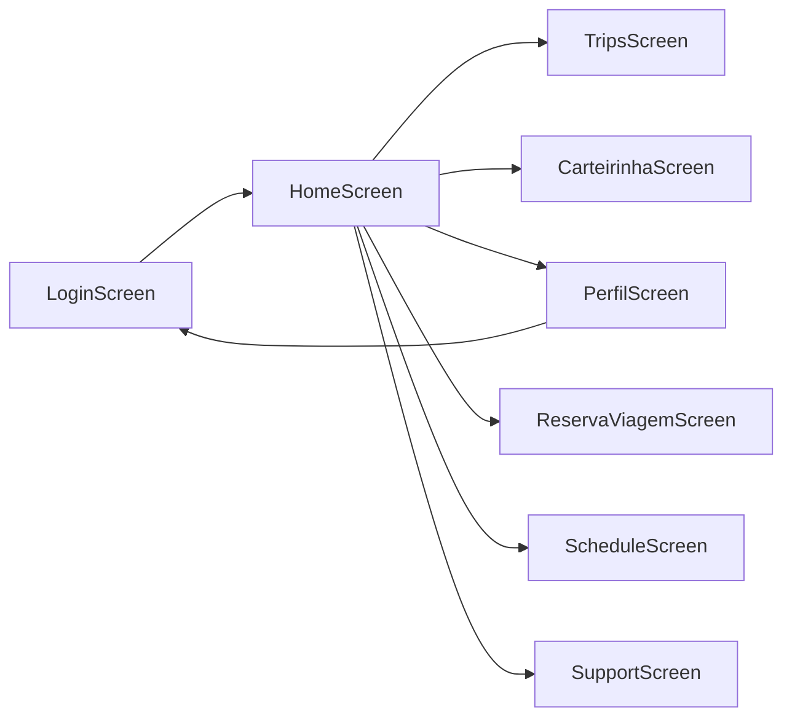

# UniPass - Aplicativo do Estudante


Sistema de gerenciamento de transporte estudantil que permite aos estudantes visualizar e gerenciar suas viagens, consultar horários, fazer reservas e acompanhar o ônibus em tempo real.

---

## 📋 Índice

- [Visão Geral](#-visão-geral)
- [Funcionalidades](#-funcionalidades)
- [Arquitetura](#-arquitetura)
- [Estrutura do Projeto](#-estrutura-do-projeto)
- [Navegação e Rotas](#-navegação-e-rotas)
- [Banco de Dados](#-banco-de-dados)
- [Autenticação e Sessão](#-autenticação-e-sessão)
- [Modelos de Dados](#-modelos-de-dados)
- [Componentes UI](#-componentes-ui)
- [Injeção de Dependência](#-injeção-de-dependência)
- [Fluxo de Dados](#-fluxo-de-dados)
- [Configuração e Instalação](#-configuração-e-instalação)
- [Tecnologias Utilizadas](#-tecnologias-utilizadas)

---

## 🎯 Visão Geral

O **UniPass** é um aplicativo Android desenvolvido em Kotlin com Jetpack Compose para gerenciamento de transporte estudantil. O app permite que estudantes:

- Façam login com CPF
- Visualizem a próxima viagem agendada
- Consultem o histórico completo de viagens
- Façam reservas de assentos
- Consultem horários de ônibus
- Vejam a localização do ônibus em tempo real
- Acessem sua carteirinha digital
- Entrem em contato com o suporte

### Screenshots

*(Adicionar screenshots aqui)*

---

## ✨ Funcionalidades

### 🔐 Tela de Login
- Autenticação por CPF e senha
- Validação de campos
- Sessão persistente com SharedPreferences
- Usuário de teste pré-cadastrado

### 🏠 Tela Inicial (Home)
- Saudação personalizada com nome do usuário ("Olá, {nome}")
- Visualização da próxima viagem agendada
- Informações de data, hora, origem e destino
- Número do assento reservado
- Progresso de ocupação do ônibus
- Acesso rápido a funcionalidades principais
- Mapa em tempo real do ônibus

### 🚌 Histórico de Viagens
- Lista completa de todas as viagens
- Filtros por status (Todas, Concluídas, Canceladas)
- Atualização em tempo real via Firestore
- Informações detalhadas de cada viagem

### 🎫 Carteirinha Digital
- Exibição da carteirinha do estudante
- Código QR para validação
- Informações do aluno

### 👤 Perfil
- Informações completas do usuário
- Estatísticas de viagens (realizadas e agendadas)
- Configurações da conta
- Opção de logout

### 📅 Reserva de Viagens
- Sistema de reserva de assentos
- Seleção de horários disponíveis
- Confirmação de reserva

### 🕐 Horários
- Lista de horários disponíveis
- Informações de rotas e vagas

### 📞 Suporte
- Canais de atendimento (telefone, email, chat)
- Perguntas frequentes (FAQ)

---

## 🏗️ Arquitetura

O projeto segue uma arquitetura em camadas baseada no padrão **MVVM (Model-View-ViewModel)** com **Repository Pattern** e **Offline-First**:

```
┌─────────────────────────────────────────────────┐
│                    UI Layer                      │
│  (Screens + Composables + Components)           │
│                                                  │
│  • HomeScreen, LoginScreen, PerfilScreen        │
│  • ScheduleScreen, SupportScreen                │
│  • Components (Cards, Headers, etc.)            │
└─────────────────────────────────────────────────┘
                        ↕
┌─────────────────────────────────────────────────┐
│               ViewModel Layer                    │
│           (State Management)                     │
│                                                  │
│  • HomeViewModel                                │
│  • LoginViewModel                               │
│  • TripsViewModel                               │
│  • StudentCardViewModel                         │
└─────────────────────────────────────────────────┘
                        ↕
┌─────────────────────────────────────────────────┐
│                 Data Layer                       │
│           (Repository Pattern)                   │
│                                                  │
│  • TripRepository (Firebase)                    │
│  • UserSessionManager (SharedPrefs)             │
│  • Room DAOs (Local DB)                         │
└─────────────────────────────────────────────────┘
                        ↕
┌─────────────────────────────────────────────────┐
│            Data Sources                          │
│                                                  │
│  ┌─────────────┐    ┌─────────────────────┐    │
│  │  Room DB    │    │  Firebase Firestore │    │
│  │  (Offline)  │    │     (Cloud)         │    │
│  └─────────────┘    └─────────────────────┘    │
└─────────────────────────────────────────────────┘
```

### Camadas

#### 1. **UI Layer** (Presentation)
- **Responsabilidade**: Interface do usuário e interação
- **Tecnologia**: Jetpack Compose
- **Localização**: `ui/screens/` e `ui/components/`
- **Características**:
  - State Hoisting
  - Composables reutilizáveis
  - Material Design 3
  - Observação de StateFlow via `collectAsStateWithLifecycle`

#### 2. **ViewModel Layer**
- **Responsabilidade**: Gerenciamento de estado e lógica de apresentação
- **Tecnologia**: Android ViewModel + Kotlin Coroutines
- **Localização**: `ui/viewmodel/`
- **Características**:
  - StateFlow para estado reativo
  - Injeção via Koin
  - Ciclo de vida consciente

#### 3. **Data Layer** (Repository)
- **Responsabilidade**: Acesso e gerenciamento de dados
- **Tecnologia**: Firebase Firestore SDK + Room
- **Localização**: `data/repository/`, `data/local/`
- **Características**:
  - Repository Pattern
  - Offline-first com Room
  - Sincronização com Firebase
  - Snapshot Listeners para tempo real

#### 4. **Model Layer**
- **Responsabilidade**: Estruturas de dados
- **Localização**: `models/`
- **Características**:
  - Data Classes
  - Entidades Room
  - Mappers entre camadas

---

## 📁 Estrutura do Projeto

```
app/src/main/java/br/edu/ifpb/unipass/
│
├── data/
│   ├── firebase/
│   │   └── FirebaseService.kt
│   ├── local/
│   │   ├── AppDatabase.kt              # Configuração Room
│   │   ├── UserSessionManager.kt       # Gerenciamento de sessão
│   │   ├── dao/
│   │   │   ├── TripDao.kt
│   │   │   ├── UserDao.kt
│   │   │   └── StudentCardDao.kt
│   │   ├── entity/
│   │   │   ├── TripEntity.kt
│   │   │   ├── UserEntity.kt
│   │   │   └── StudentCardEntity.kt
│   │   └── mapper/
│   │       └── EntityMappers.kt        # Conversão Entity <-> Model
│   └── repository/
│       ├── TripRepository.kt
│       └── EstudanteRepository.kt
│
├── di/
│   └── AppModule.kt                    # Módulo Koin
│
├── models/
│   ├── Trip.kt                         # Modelo de Viagem
│   ├── User.kt                         # Modelo de Usuário
│   ├── StudentCard.kt                  # Modelo de Carteirinha
│   ├── QuickAccessOption.kt            # Opções de acesso rápido
│   └── BottomNavItem.kt                # Itens da navegação inferior
│
├── navigation/
│   ├── AppNavHost.kt                   # Navegação principal
│   └── Routes.kt                       # Constantes de rotas
│
├── ui/
│   ├── components/                     # Componentes reutilizáveis
│   │   ├── AppTopBar.kt
│   │   ├── BottomNavigationBar.kt
│   │   ├── EmptyState.kt
│   │   ├── FilterChip.kt
│   │   ├── MainScaffold.kt
│   │   ├── NextTripCard.kt
│   │   ├── QuickAccessGrid.kt
│   │   ├── RealTimeMapSection.kt
│   │   ├── TripCard.kt
│   │   └── UserProfileHeader.kt
│   │
│   ├── screens/                        # Telas do aplicativo
│   │   ├── booking/
│   │   │   └── BookingScreen.kt
│   │   ├── home/
│   │   │   └── HomeScreen.kt
│   │   ├── login/
│   │   │   └── LoginScreen.kt
│   │   ├── profile/
│   │   │   └── PerfilScreen.kt
│   │   ├── schedule/
│   │   │   └── ScheduleScreen.kt
│   │   ├── studentCard/
│   │   │   └── CarteirinhaScreen.kt
│   │   ├── support/
│   │   │   └── SupportScreen.kt
│   │   └── trips/
│   │       ├── TripsScreen.kt
│   │       └── TripsViewModel.kt
│   │
│   ├── state/
│   │   └── UiStates.kt                 # Estados da UI
│   │
│   ├── viewmodel/                      # ViewModels
│   │   ├── HomeViewModel.kt
│   │   ├── LoginViewModel.kt
│   │   ├── StudentCardViewModel.kt
│   │   └── TripsViewModel.kt
│   │
│   └── theme/
│       ├── Theme.kt
│       └── Type.kt
│
├── UnipassApplication.kt               # Application class (Koin init)
└── MainActivity.kt                     # Activity principal
```

### Descrição dos Diretórios

| Diretório | Descrição |
|-----------|-----------|
| `data/local/` | Banco de dados Room e gerenciamento de sessão |
| `data/repository/` | Implementação do Repository Pattern |
| `di/` | Configuração de injeção de dependência (Koin) |
| `models/` | Classes de modelo (Data Classes) |
| `navigation/` | Configuração de navegação do app |
| `ui/components/` | Componentes Compose reutilizáveis |
| `ui/screens/` | Telas completas do aplicativo |
| `ui/state/` | Classes de estado da UI |
| `ui/viewmodel/` | ViewModels para gerenciamento de estado |
| `ui/theme/` | Tema e estilos do Material Design |

---

## 🧭 Navegação e Rotas

### Sistema de Navegação

O app utiliza **Navigation Compose** para gerenciar a navegação entre telas.

#### Arquivo: `navigation/Routes.kt`

```kotlin
object Routes {
    const val LOGIN = "login"
    const val HOME = "home"
    const val VIAGENS = "viagens"
    const val RESERVA = "reserva"
    const val CARTEIRINHA = "carteirinha"
    const val PERFIL = "perfil"
    const val HORARIOS = "horarios"
    const val SUPORTE = "suporte"
}
```

#### Estrutura de Navegação

```
AppNavHost
├── LOGIN (startDestination)
│
└── MainScaffold (com Bottom Navigation)
    ├── HOME
    ├── VIAGENS
    ├── CARTEIRINHA
    └── PERFIL

Telas sem Bottom Navigation:
├── RESERVA
├── HORARIOS
└── SUPORTE
```

### Fluxo de Navegação



### MainScaffold

O `MainScaffold` envolve as telas principais e fornece:
- **Bottom Navigation Bar** com 4 itens
- **Padding consistente**
- **Navegação entre Home, Viagens, Carteirinha e Perfil**

### Bottom Navigation

| Ícone | Label | Rota | Tela |
|-------|-------|------|------|
| 🏠 Home | Início | `Routes.HOME` | HomeScreen |
| 🚌 DirectionsBus | Viagens | `Routes.VIAGENS` | TripsScreen |
| 💳 CreditCard | Carteirinha | `Routes.CARTEIRINHA` | CarteirinhaScreen |
| 👤 Person | Perfil | `Routes.PERFIL` | PerfilScreen |

### Acesso Rápido (HomeScreen)

| Ícone | Label | Navega para |
|-------|-------|-------------|
| 📅 DateRange | Reservar | `Routes.RESERVA` |
| 🕐 AccessTime | Horários | `Routes.HORARIOS` |
| 📋 List | Histórico | `Routes.VIAGENS` |
| 🎧 HeadsetMic | Suporte | `Routes.SUPORTE` |

---

## 🗄️ Banco de Dados

### Arquitetura de Dados (Offline-First)

O app utiliza uma estratégia **offline-first** com duas fontes de dados:

1. **Room Database** (Local) - Dados offline e cache
2. **Firebase Firestore** (Cloud) - Sincronização e tempo real

```
┌─────────────────────────────────────────────────────┐
│                    ViewModel                         │
└─────────────────────────────────────────────────────┘
                         │
                         ▼
┌─────────────────────────────────────────────────────┐
│                   Repository                         │
│  1. Carrega do Room (offline)                       │
│  2. Sincroniza com Firebase (online)                │
│  3. Salva no Room para próxima vez                  │
└─────────────────────────────────────────────────────┘
            │                          │
            ▼                          ▼
┌─────────────────────┐    ┌─────────────────────────┐
│     Room (Local)    │    │  Firebase Firestore     │
│  - UserEntity       │    │  - /trips               │
│  - TripEntity       │    │  - /users/{id}/trips    │
│  - StudentCardEntity│    │                         │
└─────────────────────┘    └─────────────────────────┘
```

### Room Database

#### Entidades

**UserEntity**
```kotlin
@Entity(tableName = "users")
data class UserEntity(
    @PrimaryKey val id: String,
    val name: String,
    val cpf: String,
    val email: String = "",
    val photoUrl: String? = null,
    val notificationCount: Int = 0,
    val createdAt: Long,
    val updatedAt: Long
)
```

**TripEntity**
```kotlin
@Entity(tableName = "trips")
data class TripEntity(
    @PrimaryKey val id: String,
    val userId: String,
    val date: String,
    val time: String,
    val origin: String,
    val destination: String,
    val seatNumber: String,
    val status: String,
    val reservedSeats: Int,
    val totalSeats: Int
)
```

#### DAOs

**UserDao**
```kotlin
@Dao
interface UserDao {
    @Query("SELECT * FROM users WHERE id = :userId")
    fun getUserById(userId: String): Flow<UserEntity?>

    @Query("SELECT * FROM users WHERE cpf = :cpf")
    suspend fun getUserByCpf(cpf: String): UserEntity?

    @Insert(onConflict = OnConflictStrategy.REPLACE)
    suspend fun insertUser(user: UserEntity)
}
```

**TripDao**
```kotlin
@Dao
interface TripDao {
    @Query("SELECT * FROM trips WHERE userId = :userId ORDER BY date DESC")
    fun getNextTrip(userId: String): Flow<TripEntity?>

    @Insert(onConflict = OnConflictStrategy.REPLACE)
    suspend fun insertTrip(trip: TripEntity)

    @Update
    suspend fun updateTrip(trip: TripEntity)
}
```

### Firebase Firestore

#### Estrutura de Dados

```
Firestore Database
│
├── trips (collection)
│   └── [document_id]
│       ├── date: String
│       ├── time: String
│       ├── origin: String
│       ├── destination: String
│       ├── seatNumber: String
│       ├── status: String
│       ├── reservedSeats: Number
│       └── totalSeats: Number
│
└── users (collection)
    └── [userId] (document)
        └── trips (subcollection)
            └── [document_id]
                └── ...
```

---

## 🔐 Autenticação e Sessão

### UserSessionManager

O app utiliza `SharedPreferences` para gerenciar a sessão do usuário.

**Arquivo**: `data/local/UserSessionManager.kt`

```kotlin
class UserSessionManager(context: Context) {

    fun saveUserSession(userId: String, userName: String, userCpf: String)
    fun getUserId(): String?
    fun getUserName(): String?
    fun getUserCpf(): String?
    fun isLoggedIn(): Boolean
    fun clearSession()
}
```

### Fluxo de Autenticação

```
┌─────────────────────────────────────────────────────┐
│                  LoginScreen                         │
│  1. Usuário digita CPF e senha                      │
│  2. LoginViewModel.onLoginClick()                   │
└─────────────────────────────────────────────────────┘
                         │
                         ▼
┌─────────────────────────────────────────────────────┐
│                  LoginViewModel                      │
│  1. Valida CPF (11 dígitos)                         │
│  2. Busca usuário no Room por CPF                   │
│  3. Se encontrar: salva sessão e navega             │
│  4. Se não: exibe erro                              │
└─────────────────────────────────────────────────────┘
                         │
                         ▼
┌─────────────────────────────────────────────────────┐
│               UserSessionManager                     │
│  saveUserSession(userId, userName, userCpf)         │
└─────────────────────────────────────────────────────┘
                         │
                         ▼
┌─────────────────────────────────────────────────────┐
│                  HomeScreen                          │
│  HomeViewModel usa userId da sessão                 │
│  Exibe "Olá, {userName}"                            │
└─────────────────────────────────────────────────────┘
```

### Usuário de Teste

O `LoginViewModel` cria automaticamente um usuário de teste:

| Campo | Valor |
|-------|-------|
| CPF | `12345678900` |
| Nome | Maria Silva Santos |
| Email | maria.santos@estudante.edu.br |
| Senha | qualquer texto |

---

## 📦 Modelos de Dados

### Trip (Viagem)

**Arquivo**: `models/Trip.kt`

```kotlin
data class Trip(
    val id: String = "",
    val date: String = "",
    val time: String = "",
    val origin: String = "",
    val destination: String = "",
    val seatNumber: String = "",
    val status: TripStatus = TripStatus.SCHEDULED,
    val reservedSeats: Int = 0,
    val totalSeats: Int = 0
)

enum class TripStatus(val value: String) {
    SCHEDULED("SCHEDULED"),
    COMPLETED("COMPLETED"),
    CANCELLED("CANCELLED"),
    NO_SHOW("NO_SHOW")
}
```

### User (Usuário)

**Arquivo**: `models/User.kt`

```kotlin
data class User(
    val name: String,
    val initials: String,
    val notificationCount: Int = 0
)
```

### StudentCard (Carteirinha)

**Arquivo**: `models/StudentCard.kt`

```kotlin
data class StudentCard(
    val id: String,
    val studentName: String,
    val institution: String,
    val course: String,
    val shift: String,
    val cardNumber: String,
    val isActive: Boolean,
    val validUntil: String,
    val photoUrl: String?
)
```

---

## 🎨 Componentes UI

### Componentes Reutilizáveis

| Componente | Arquivo | Descrição |
|------------|---------|-----------|
| AppTopBar | `AppTopBar.kt` | Barra superior com navegação e menu |
| BottomNavigationBar | `BottomNavigationBar.kt` | Navegação inferior |
| EmptyState | `EmptyState.kt` | Estado vazio com ícone e mensagem |
| FilterChip | `FilterChip.kt` | Chip de filtro selecionável |
| MainScaffold | `MainScaffold.kt` | Scaffold com Bottom Navigation |
| NextTripCard | `NextTripCard.kt` | Card da próxima viagem |
| QuickAccessGrid | `QuickAccessGrid.kt` | Grade de acesso rápido |
| RealTimeMapSection | `RealTimeMapSection.kt` | Seção de mapa em tempo real |
| TripCard | `TripCard.kt` | Card de viagem no histórico |
| UserProfileHeader | `UserProfileHeader.kt` | Cabeçalho com avatar e nome |

---

## 💉 Injeção de Dependência

### Koin

O app utiliza **Koin** para injeção de dependência.

**Arquivo**: `di/AppModule.kt`

```kotlin
val appModule = module {
    // Firebase
    single { FirebaseFirestore.getInstance() }

    // Database
    single { AppDatabase.getDatabase(androidContext()) }

    // Session Manager
    single { UserSessionManager(androidContext()) }

    // DAOs
    single { get<AppDatabase>().tripDao() }
    single { get<AppDatabase>().userDao() }
    single { get<AppDatabase>().studentCardDao() }

    // Repositories
    single { TripRepository(get()) }

    // ViewModels
    viewModel {
        LoginViewModel(database = get(), sessionManager = get())
    }

    viewModel {
        val sessionManager: UserSessionManager = get()
        val userId = sessionManager.getUserId() ?: "guest"
        HomeViewModel(database = get(), tripRepository = get(), userId = userId)
    }

    viewModel {
        TripsViewModel(tripRepository = get(), database = get())
    }
}
```

### Inicialização

**Arquivo**: `UnipassApplication.kt`

```kotlin
class UnipassApplication : Application() {
    override fun onCreate() {
        super.onCreate()
        startKoin {
            androidContext(this@UnipassApplication)
            modules(appModule)
        }
    }
}
```

---

## 🔄 Fluxo de Dados

### Tempo Real com Snapshot Listeners + Room

O app utiliza uma estratégia offline-first:

1. **Carrega do Room** (instantâneo, offline)
2. **Sincroniza com Firebase** (quando online)
3. **Salva no Room** para próxima vez

```kotlin
// HomeViewModel
private fun observeNextTrip() {
    // 1. Carrega do Room primeiro
    viewModelScope.launch {
        database.tripDao().getNextTrip(userId).collect { tripEntity ->
            _uiState.update { state ->
                state.copy(nextTrip = tripEntity?.toTrip(), isLoading = false)
            }
        }
    }

    // 2. Sincroniza com Firebase
    tripListener = tripRepository.observeNextTrip(userId) { trip ->
        viewModelScope.launch {
            if (trip != null) {
                // 3. Salva no Room
                database.tripDao().insertTrip(trip.toEntity(userId))
            }
            _uiState.update { state ->
                state.copy(nextTrip = trip, isLoading = false)
            }
        }
    }
}
```

---

## ⚙️ Configuração e Instalação

### Pré-requisitos

- **Android Studio** Hedgehog (2023.1.1) ou superior
- **JDK** 17 ou superior
- **SDK Android** API 24+ (Android 7.0) até API 36
- **Conta Google** para Firebase

### Passos de Instalação

#### 1. Clone o Repositório

```bash
git clone https://github.com/joanaeliseal/unipass-student-app.git
cd unipass-student-app
```

#### 2. Configure o Firebase

1. Acesse [Firebase Console](https://console.firebase.google.com)
2. Crie um projeto e adicione um app Android
3. **Package name**: `br.edu.ifpb.unipass`
4. Baixe o arquivo `google-services.json`
5. Cole em `app/google-services.json`
6. Ative o Firestore Database

#### 3. Sincronize e Execute

1. Abra o projeto no Android Studio
2. Aguarde a sincronização do Gradle
3. Execute o app (`Shift + F10`)

#### 4. Login de Teste

- **CPF**: `12345678900`
- **Senha**: qualquer texto

---

## 🛠️ Tecnologias Utilizadas

### Core

| Tecnologia | Versão | Descrição |
|------------|--------|-----------|
| **Kotlin** | 1.9+ | Linguagem de programação |
| **Android SDK** | API 24-36 | Plataforma Android |
| **Jetpack Compose** | 2024+ | UI declarativa |
| **Material Design 3** | Latest | Design system |

### Persistência

| Tecnologia | Descrição |
|------------|-----------|
| **Room** | Banco de dados local SQLite |
| **Firebase Firestore** | Banco de dados NoSQL em nuvem |
| **SharedPreferences** | Armazenamento de sessão |

### Arquitetura

| Tecnologia | Descrição |
|------------|-----------|
| **Koin** | Injeção de dependência |
| **ViewModel** | Gerenciamento de estado |
| **StateFlow** | Estado reativo |
| **Coroutines** | Programação assíncrona |

### Navegação

| Biblioteca | Versão | Uso |
|------------|--------|-----|
| `navigation-compose` | 2.7.7 | Navegação entre telas |

---

## 📝 Notas Importantes

### Dados Mockados

Alguns dados ainda estão mockados e devem ser integrados com o backend:

| Tela | Dados Mockados |
|------|----------------|
| PerfilScreen | Informações do usuário (exceto nome) |
| ScheduleScreen | Lista de horários |
| BookingScreen | Viagens disponíveis |
| SupportScreen | Dados de contato e FAQ |

### Próximos Passos

- [ ] Implementar autenticação real (Firebase Auth)
- [ ] Integrar dados do perfil com backend
- [ ] Implementar sistema de reservas completo
- [ ] Adicionar mapa real com Google Maps
- [ ] Implementar notificações push
- [ ] Adicionar testes unitários e de UI
- [ ] Configurar CI/CD

---

## 📄 Licença

Este projeto foi desenvolvido para fins educacionais no IFPB.

---

## 👥 Equipe

- Desenvolvido por: Joana Elise e Maria Eduarda Vitorino
- Orientação: Prof. Edemberg Rocha

---

## 📧 Contato

Para dúvidas ou sugestões:
- GitHub: [joanaeliseal](https://github.com/joanaeliseal)
- GitHub: [vtrnduda](https://github.com/vtrnduda)

---

- **Documentação criada em**: Dezembro/2025
- **Última atualização**: Fevereiro/2026
