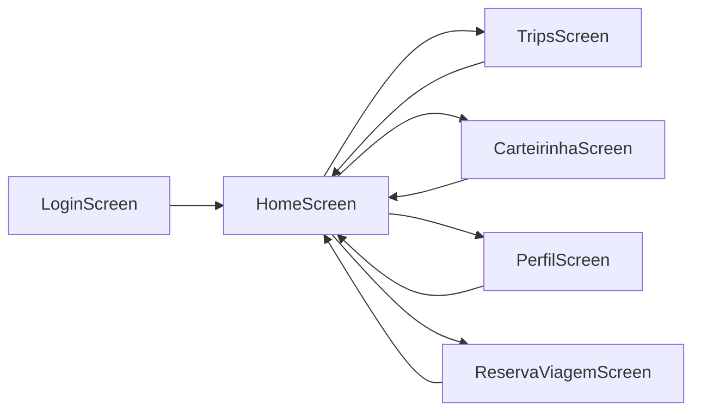

# UniPass - Aplicativo do Estudante


Sistema de gerenciamento de transporte estudantil que permite aos estudantes visualizar e gerenciar suas viagens, consultar horários, fazer reservas e acompanhar o ônibus em tempo real.

---

## 📋 Índice

- [Visão Geral](#-visão-geral)
- [Funcionalidades](#-funcionalidades)
- [Arquitetura](#-arquitetura)
- [Estrutura do Projeto](#-estrutura-do-projeto)
- [Navegação e Rotas](#-navegação-e-rotas)
- [Banco de Dados](#-banco-de-dados)
- [Modelos de Dados](#-modelos-de-dados)
- [Componentes UI](#-componentes-ui)
- [Fluxo de Dados](#-fluxo-de-dados)
- [Configuração e Instalação](#-configuração-e-instalação)
- [Tecnologias Utilizadas](#-tecnologias-utilizadas)

---

## 🎯 Visão Geral

O **UniPass** é um aplicativo Android desenvolvido em Kotlin com Jetpack Compose para gerenciamento de transporte estudantil. O app permite que estudantes:

- Visualizem a próxima viagem agendada
- Consultem o histórico completo de viagens
- Façam reservas de assentos
- Vejam a localização do ônibus em tempo real
- Acessem sua carteirinha digital

### Screenshots

*(Adicionar screenshots aqui)*

---

## ✨ Funcionalidades

### 🏠 Tela Inicial (Home)
- Visualização da próxima viagem agendada
- Informações de data, hora, origem e destino
- Número do assento reservado
- Progresso de ocupação do ônibus
- Acesso rápido a funcionalidades principais
- Mapa em tempo real do ônibus

### 🚌 Histórico de Viagens
- Lista completa de todas as viagens
- Filtros por status (Todas, Concluídas, Canceladas)
- Atualização em tempo real via Firestore
- Informações detalhadas de cada viagem

### 🎫 Carteirinha Digital
- Exibição da carteirinha do estudante
- Código QR para validação
- Informações do aluno

### 👤 Perfil
- Informações do usuário
- Configurações da conta

### 📅 Reserva de Viagens
- Sistema de reserva de assentos
- Seleção de horários disponíveis

---

## 🏗️ Arquitetura

O projeto segue uma arquitetura em camadas inspirada no padrão **MVVM (Model-View-ViewModel)** adaptado para Jetpack Compose:

```
┌─────────────────────────────────────────────────┐
│                    UI Layer                      │
│  (Screens + Composables + Components)           │
│                                                  │
│  • HomeScreen.kt                                │
│  • TripsScreen.kt                               │
│  • CarteirinhaScreen.kt                         │
│  • Components (Cards, Headers, etc.)            │
└─────────────────────────────────────────────────┘
                        ↕
┌─────────────────────────────────────────────────┐
│                 Data Layer                       │
│           (Repository Pattern)                   │
│                                                  │
│  • TripRepository.kt                            │
│    - Snapshot Listeners (Tempo Real)            │
│    - CRUD Operations                            │
└─────────────────────────────────────────────────┘
                        ↕
┌─────────────────────────────────────────────────┐
│              Firebase Firestore                  │
│           (Cloud NoSQL Database)                 │
│                                                  │
│  Collections:                                    │
│  • trips/                                       │
│  • users/{userId}/trips/                        │
└─────────────────────────────────────────────────┘
```

### Camadas

#### 1. **UI Layer** (Presentation)
- **Responsabilidade**: Interface do usuário e interação
- **Tecnologia**: Jetpack Compose
- **Localização**: `ui/screens/` e `ui/components/`
- **Características**:
  - State Hoisting
  - Composables reutilizáveis
  - Material Design 3

#### 2. **Data Layer** (Domain/Repository)
- **Responsabilidade**: Acesso e gerenciamento de dados
- **Tecnologia**: Firebase Firestore SDK
- **Localização**: `repository/`
- **Características**:
  - Repository Pattern
  - Snapshot Listeners para tempo real
  - Tratamento de erros
  - Logging para debug

#### 3. **Model Layer**
- **Responsabilidade**: Estruturas de dados
- **Localização**: `models/`
- **Características**:
  - Data Classes
  - Serialização Firestore
  - Computed Properties

---

## 📁 Estrutura do Projeto

```
app/src/main/java/br/edu/ifpb/unipass/
│
├── data/
│   ├── firebase/
│   │   └── FirebaseService.kt
│   └── repository/
│       ├── EstudanteRepository.kt
│       └── ViagemRepository.kt
│
├── models/
│   ├── Trip.kt                    # Modelo de Viagem
│   ├── User.kt                    # Modelo de Usuário
│   ├── QuickAccessOption.kt       # Opções de acesso rápido
│   └── BottomNavItem.kt          # Itens da navegação inferior
│
├── navigation/
│   ├── AppNavHost.kt             # Navegação principal
│   └── Routes.kt                 # Constantes de rotas
│
├── repository/
│   └── TripRepository.kt         # Repository de Viagens (Firestore)
│
├── ui/
│   ├── components/               # Componentes reutilizáveis
│   │   ├── AppTopBar.kt
│   │   ├── BottomNavigationBar.kt
│   │   ├── EmptyState.kt
│   │   ├── FilterChip.kt
│   │   ├── MainScaffold.kt
│   │   ├── NextTripCard.kt
│   │   ├── QuickAccessGrid.kt
│   │   ├── RealTimeMapSection.kt
│   │   ├── TripCard.kt
│   │   └── UserProfileHeader.kt
│   │
│   ├── screens/                  # Telas do aplicativo
│   │   ├── booking/
│   │   │   └── ReservaViagemScreen.kt
│   │   ├── home/
│   │   │   └── HomeScreen.kt
│   │   ├── login/
│   │   │   └── LoginScreen.kt
│   │   ├── profile/
│   │   │   └── PerfilScreen.kt
│   │   ├── studentCard/
│   │   │   └── CarteirinhaScreen.kt
│   │   └── trips/
│   │       └── TripsScreen.kt
│   │
│   └── theme/
│       └── UnipassTheme.kt
│
└── MainActivity.kt               # Activity principal
```

### Descrição dos Diretórios

| Diretório | Descrição |
|-----------|-----------|
| `data/` | Camada de dados (legacy, não utilizada atualmente) |
| `models/` | Classes de modelo (Data Classes) |
| `navigation/` | Configuração de navegação do app |
| `repository/` | Implementação do Repository Pattern |
| `ui/components/` | Componentes Compose reutilizáveis |
| `ui/screens/` | Telas completas do aplicativo |
| `ui/theme/` | Tema e estilos do Material Design |

---

## 🧭 Navegação e Rotas

### Sistema de Navegação

O app utiliza **Navigation Compose** para gerenciar a navegação entre telas.

#### Arquivo: `navigation/Routes.kt`

```kotlin
object Routes {
    const val LOGIN = "login"
    const val HOME = "home"
    const val VIAGENS = "viagens"
    const val CARTEIRINHA = "carteirinha"
    const val PERFIL = "perfil"
    const val RESERVA = "reserva"
}
```

#### Arquivo: `navigation/AppNavHost.kt`

**Estrutura de Navegação:**

```
AppNavHost
├── LOGIN (startDestination)
│
└── MainScaffold (com Bottom Navigation)
    ├── HOME
    ├── VIAGENS
    ├── CARTEIRINHA
    └── PERFIL

RESERVA (tela separada, sem Bottom Navigation)
```

### Fluxo de Navegação



### MainScaffold

O `MainScaffold` envolve as telas principais e fornece:
- **Bottom Navigation Bar** com 4 itens
- **Padding consistente**
- **Navegação entre Home, Viagens, Carteirinha e Perfil**

```kotlin
MainScaffold(navController) { modifier ->
    // Conteúdo da tela
}
```

### Bottom Navigation

| Ícone | Label | Rota | Tela |
|-------|-------|------|------|
| 🏠 Home | Início | `Routes.HOME` | HomeScreen |
| 🚌 DirectionsBus | Viagens | `Routes.VIAGENS` | TripsScreen |
| 💳 CreditCard | Carteirinha | `Routes.CARTEIRINHA` | CarteirinhaScreen |
| 👤 Person | Perfil | `Routes.PERFIL` | PerfilScreen |

---

## 🗄️ Banco de Dados

### Firebase Firestore

O app utiliza **Firebase Firestore** como banco de dados NoSQL em nuvem.

#### Estrutura de Dados no Firestore

```
Firestore Database
│
├── trips (collection)
│   ├── [document_id]
│   │   ├── date: String              # "2025-12-20"
│   │   ├── time: String              # "07:30"
│   │   ├── origin: String            # "Sapé"
│   │   ├── destination: String       # "UFPB"
│   │   ├── seatNumber: String        # "12B"
│   │   ├── status: String            # "SCHEDULED"
│   │   ├── reservedSeats: Number     # 39
│   │   └── totalSeats: Number        # 40
│   │
│   └── [document_id]
│       └── ...
│
└── users (collection)
    └── [userId] (document)
        └── trips (subcollection)
            ├── [document_id]
            │   ├── date: String
            │   ├── time: String
            │   ├── origin: String
            │   ├── destination: String
            │   ├── seatNumber: String
            │   └── status: String
            │
            └── [document_id]
                └── ...
```

#### Coleções e Documentos

##### 1. **Collection: `trips`**
- **Propósito**: Armazena viagens agendadas (próximas viagens)
- **Filtro**: `status == "SCHEDULED"`
- **Ordenação**: Por data (mais próxima primeiro)
- **Usado em**: HomeScreen

##### 2. **Collection: `users/{userId}/trips`** (Subcoleção)
- **Propósito**: Armazena histórico de viagens de cada usuário
- **Filtros**: Todos os status (COMPLETED, CANCELLED, NO_SHOW, SCHEDULED)
- **Ordenação**: Por data (mais recente primeiro)
- **Usado em**: TripsScreen

### TripRepository

O `TripRepository` é responsável por toda comunicação com o Firestore.

#### Funções Principais

##### 1. **Snapshot Listeners (Tempo Real)**

```kotlin
fun observeNextTrip(onTripUpdate: (Trip?) -> Unit): ListenerRegistration
```
- Observa viagens com `status="SCHEDULED"`
- Retorna a primeira viagem (próxima)
- Atualiza automaticamente quando dados mudam
- Usado em: **HomeScreen**

```kotlin
fun observeUserTripHistory(userId: String, onTripsUpdate: (List<Trip>) -> Unit): ListenerRegistration
```
- Observa histórico de viagens do usuário
- Retorna lista ordenada por data (decrescente)
- Atualiza automaticamente quando dados mudam
- Usado em: **TripsScreen**

##### 2. **Queries Únicas (One-time reads)**

```kotlin
suspend fun getNextTrip(): Trip?
```
- Busca próxima viagem (execução única)
- Retorna null se não houver viagens

```kotlin
suspend fun getUserTripHistory(userId: String): List<Trip>
```
- Busca histórico completo (execução única)
- Retorna lista vazia se não houver viagens

##### 3. **Utilidades**

```kotlin
fun filterTripsByStatus(trips: List<Trip>, status: String): List<Trip>
```
- Filtra viagens por status
- Usado localmente após buscar dados

### Firestore Security Rules

```javascript
rules_version = '2';
service cloud.firestore {
  match /databases/{database}/documents {

    // Coleção de viagens públicas
    match /trips/{tripId} {
      allow read: if true;  // Todos podem ler
      allow write: if false; // Apenas admin pode escrever
    }

    // Histórico de viagens do usuário
    match /users/{userId}/trips/{tripId} {
      allow read: if request.auth != null && request.auth.uid == userId;
      allow write: if request.auth != null && request.auth.uid == userId;
    }
  }
}
```

**Nota**: As regras acima são para produção. Durante desenvolvimento, use:

```javascript
match /{document=**} {
  allow read, write: if true;
}
```

---

## 📦 Modelos de Dados

### Trip (Viagem)

**Arquivo**: `models/Trip.kt`

```kotlin
data class Trip(
    val id: String = "",
    val date: String = "",              // "2025-12-20"
    val time: String = "",              // "07:30"
    val origin: String = "",            // "Sapé"
    val destination: String = "",       // "UFPB"
    val seatNumber: String = "",        // "12B"
    val status: String = "SCHEDULED",   // SCHEDULED, COMPLETED, CANCELLED, NO_SHOW
    val reservedSeats: Int = 0,
    val totalSeats: Int = 0
)
```

#### Computed Properties

```kotlin
val route: String               // "Sapé → UFPB"
val dateTime: String            // "2025-12-20 às 07:30"
val progress: Float             // 0.975 (39/40)
val isCompleted: Boolean        // true se COMPLETED
val isCancelled: Boolean        // true se CANCELLED ou NO_SHOW
```

#### Status Possíveis

| Status | Descrição | Badge Color |
|--------|-----------|-------------|
| `SCHEDULED` | Viagem agendada | 🔵 Azul |
| `COMPLETED` | Viagem concluída | 🟢 Verde |
| `CANCELLED` | Viagem cancelada | 🔴 Vermelho |
| `NO_SHOW` | Não compareceu | 🟠 Laranja |

### User (Usuário)

**Arquivo**: `models/User.kt`

```kotlin
data class User(
    val name: String,
    val initials: String,
    val notificationCount: Int = 0
)
```

**Nota**: Atualmente mockado. Deve ser substituído por dados de autenticação real.

### QuickAccessOption

**Arquivo**: `models/QuickAccessOption.kt`

```kotlin
data class QuickAccessOption(
    val icon: ImageVector,
    val label: String,
    val onClick: () -> Unit
)
```

Usado para os botões de acesso rápido na HomeScreen.

### BottomNavItem

**Arquivo**: `models/BottomNavItem.kt`

```kotlin
data class BottomNavItem(
    val route: String,
    val label: String,
    val icon: ImageVector,
    val selectedIcon: ImageVector
)
```

Define os itens da barra de navegação inferior.

---

## 🎨 Componentes UI

### Componentes Reutilizáveis

#### NextTripCard
- **Arquivo**: `ui/components/NextTripCard.kt`
- **Propósito**: Exibe a próxima viagem na HomeScreen
- **Props**:
  - `trip: Trip?` - Dados da viagem
  - `onViewMap: () -> Unit`
  - `onCancelReservation: () -> Unit`
  - `onViewDetails: () -> Unit`

#### TripCard
- **Arquivo**: `ui/components/TripCard.kt`
- **Propósito**: Exibe uma viagem no histórico
- **Props**:
  - `trip: Trip` - Dados da viagem
- **Features**:
  - Badge de status colorido
  - Data e hora
  - Origem e destino
  - Número do assento

#### UserProfileHeader
- **Arquivo**: `ui/components/UserProfileHeader.kt`
- **Propósito**: Cabeçalho com informações do usuário
- **Props**:
  - `user: User`
  - `onNotificationClick: () -> Unit`

#### QuickAccessGrid
- **Arquivo**: `ui/components/QuickAccessGrid.kt`
- **Propósito**: Grade de botões de acesso rápido
- **Props**:
  - `options: List<QuickAccessOption>`

#### EmptyState
- **Arquivo**: `ui/components/EmptyState.kt`
- **Propósito**: Estado vazio quando não há dados
- **Props**:
  - `icon: ImageVector`
  - `title: String`
  - `description: String`

#### FilterChip
- **Arquivo**: `ui/components/FilterChip.kt`
- **Propósito**: Chip de filtro selecionável
- **Props**:
  - `label: String`
  - `isSelected: Boolean`
  - `onClick: () -> Unit`

#### RealTimeMapSection
- **Arquivo**: `ui/components/RealTimeMapSection.kt`
- **Propósito**: Seção de mapa em tempo real
- **Props**:
  - `onViewFullMap: () -> Unit`

#### MainScaffold
- **Arquivo**: `ui/components/MainScaffold.kt`
- **Propósito**: Scaffold com Bottom Navigation
- **Props**:
  - `navController: NavController`
  - `content: @Composable (Modifier) -> Unit`

---

## 🔄 Fluxo de Dados

### Tempo Real com Snapshot Listeners

O app utiliza **Firestore Snapshot Listeners** para atualização em tempo real.

#### Exemplo: HomeScreen

```kotlin
// 1. Criar estado
var nextTrip by remember { mutableStateOf<Trip?>(null) }

// 2. Iniciar listener
DisposableEffect(Unit) {
    val listener = repository.observeNextTrip { trip ->
        nextTrip = trip  // ⬅️ Atualiza automaticamente
    }

    // 3. Cleanup ao sair da tela
    onDispose {
        listener.remove()
    }
}

// 4. UI reage automaticamente
NextTripCard(trip = nextTrip)
```

#### Fluxo Detalhado

```
┌──────────────────────────────────────────────────────────┐
│ 1. Tela é Composta                                        │
│    DisposableEffect(Unit) é executado                     │
└──────────────────────────────────────────────────────────┘
                          ⬇️
┌──────────────────────────────────────────────────────────┐
│ 2. TripRepository.observeNextTrip() é chamado             │
│    Firestore Snapshot Listener é registrado               │
└──────────────────────────────────────────────────────────┘
                          ⬇️
┌──────────────────────────────────────────────────────────┐
│ 3. Firestore retorna dados iniciais                      │
│    Callback é executado: onTripUpdate(trip)               │
│    Estado é atualizado: nextTrip = trip                   │
└──────────────────────────────────────────────────────────┘
                          ⬇️
┌──────────────────────────────────────────────────────────┐
│ 4. UI é recomposta automaticamente                       │
│    NextTripCard exibe os dados                            │
└──────────────────────────────────────────────────────────┘
                          ⬇️
┌──────────────────────────────────────────────────────────┐
│ 5. Documento muda no Firestore                           │
│    (Usuário adiciona/edita/remove documento)              │
└──────────────────────────────────────────────────────────┘
                          ⬇️
┌──────────────────────────────────────────────────────────┐
│ 6. Snapshot Listener detecta mudança                     │
│    Callback é executado novamente                         │
│    Estado é atualizado automaticamente                    │
└──────────────────────────────────────────────────────────┘
                          ⬇️
┌──────────────────────────────────────────────────────────┐
│ 7. UI recomposta com novos dados                         │
│    SEM necessidade de refresh manual                      │
└──────────────────────────────────────────────────────────┘
                          ⬇️
┌──────────────────────────────────────────────────────────┐
│ 8. Usuário sai da tela                                    │
│    onDispose() é chamado                                  │
│    listener.remove() cancela o listener                   │
└──────────────────────────────────────────────────────────┘
```

### Filtros na TripsScreen

```kotlin
// Estado de filtro
var selectedFilter by remember { mutableStateOf(TripFilter.ALL) }

// Filtragem local
val filteredTrips = when (selectedFilter) {
    TripFilter.ALL -> allTrips
    TripFilter.COMPLETED -> allTrips.filter { it.status == "COMPLETED" }
    TripFilter.CANCELLED -> allTrips.filter {
        it.status == "CANCELLED" || it.status == "NO_SHOW"
    }
}

// UI exibe trips filtradas
LazyColumn {
    items(filteredTrips) { trip ->
        TripCard(trip = trip)
    }
}
```

---

## ⚙️ Configuração e Instalação

### Pré-requisitos

- **Android Studio** Hedgehog (2023.1.1) ou superior
- **JDK** 11 ou superior
- **SDK Android** API 24+ (Android 7.0) até API 36
- **Conta Google** para Firebase

### Passos de Instalação

#### 1. Clone o Repositório

```bash
git clone https://github.com/seu-usuario/unipass-student-app.git
cd unipass-student-app
```

#### 2. Configure o Firebase

##### a) Crie um Projeto no Firebase

1. Acesse [Firebase Console](https://console.firebase.google.com)
2. Clique em "Adicionar projeto"
3. Nomeie como "UniPass" ou similar
4. Siga o assistente de configuração

##### b) Adicione um App Android

1. No projeto Firebase, clique em "Adicionar app" > ícone Android
2. **Package name**: `br.edu.ifpb.unipass`
3. **App nickname**: UniPass Student App
4. Baixe o arquivo `google-services.json`

##### c) Adicione o google-services.json

```bash
# Cole o arquivo em:
app/google-services.json
```

##### d) Ative o Firestore

1. No Firebase Console, vá para "Firestore Database"
2. Clique em "Criar banco de dados"
3. Escolha "Modo de produção" ou "Modo de teste"
4. Selecione a região (ex: southamerica-east1)

##### e) Configure as Regras (Desenvolvimento)

```javascript
rules_version = '2';
service cloud.firestore {
  match /databases/{database}/documents {
    match /{document=**} {
      allow read, write: if true;
    }
  }
}
```

**⚠️ Atenção**: Essas regras são INSEGURAS. Use apenas para desenvolvimento!

#### 3. Adicione Dados de Teste

##### Coleção: `trips`

Adicione um documento manualmente:

```json
{
  "date": "2025-12-20",
  "time": "07:30",
  "origin": "Sapé",
  "destination": "UFPB",
  "seatNumber": "12B",
  "status": "SCHEDULED",
  "reservedSeats": 39,
  "totalSeats": 40
}
```

##### Coleção: `users/user123/trips`

1. Crie coleção `users`
2. Crie documento com ID `user123`
3. Dentro dele, crie subcoleção `trips`
4. Adicione documentos:

```json
{
  "date": "2025-12-10",
  "time": "15:00",
  "origin": "UFPB",
  "destination": "Sapé",
  "seatNumber": "A5",
  "status": "COMPLETED"
}
```

#### 4. Sincronize o Projeto

1. Abra o projeto no Android Studio
2. Aguarde a sincronização do Gradle
3. Clique em "Sync Project with Gradle Files" (🐘)

#### 5. Execute o App

1. Conecte um dispositivo Android ou inicie um emulador
2. Clique em "Run" (▶️) ou pressione `Shift + F10`
3. O app será instalado e iniciado automaticamente

---

## 🛠️ Tecnologias Utilizadas

### Core

| Tecnologia | Versão | Descrição |
|------------|--------|-----------|
| **Kotlin** | 1.9+ | Linguagem de programação |
| **Android SDK** | API 24-36 | Plataforma Android |
| **Jetpack Compose** | 2024+ | UI declarativa |
| **Material Design 3** | Latest | Design system |

### Firebase

| Serviço | Descrição |
|---------|-----------|
| **Firestore** | Banco de dados NoSQL em tempo real |
| **Firebase BOM** | 33.6.0 - Gerenciamento de versões |

### Bibliotecas Android

| Biblioteca | Versão | Uso |
|------------|--------|-----|
| `androidx.core:core-ktx` | 1.17.0 | Extensões Kotlin |
| `androidx.lifecycle:lifecycle-runtime-ktx` | Latest | Lifecycle |
| `androidx.activity:activity-compose` | 1.11.0 | Activity Compose |
| `androidx.navigation:navigation-compose` | 2.7.7 | Navegação |
| `androidx.compose.material:material-icons-extended` | Latest | Ícones Material |

### Configuração do Gradle

**build.gradle.kts (Project)**

```kotlin
plugins {
    id("com.android.application") version "8.1.0" apply false
    id("org.jetbrains.kotlin.android") version "1.9.0" apply false
    id("com.google.gms.google-services") version "4.4.0" apply false
}
```

**build.gradle.kts (Module: app)**

```kotlin
plugins {
    id("com.android.application")
    id("org.jetbrains.kotlin.android")
    id("com.google.gms.google-services")
}

android {
    compileSdk = 36

    defaultConfig {
        minSdk = 24
        targetSdk = 34
    }
}

dependencies {
    // Firebase
    implementation(platform("com.google.firebase:firebase-bom:33.6.0"))
    implementation("com.google.firebase:firebase-firestore-ktx")

    // Compose
    implementation(platform("androidx.compose:compose-bom:2024.xx.xx"))
    implementation("androidx.compose.ui:ui")
    implementation("androidx.compose.material3:material3")

    // Navigation
    implementation("androidx.navigation:navigation-compose:2.7.7")
}
```

---

## 📝 Notas Importantes

### Dados Mockados

Atualmente, o app contém alguns dados hardcoded que devem ser substituídos:

1. **User (HomeScreen.kt:33-37)**
   ```kotlin
   val currentUser = User(
       name = "Maria",  // ❌ Deve vir da autenticação
       initials = "MS",
       notificationCount = 3
   )
   ```

2. **UserID (TripsScreen.kt:42)**
   ```kotlin
   repository.observeUserTripHistory("user123")  // ❌ Deve ser dinâmico
   ```

### Próximos Passos

- [ ] Implementar autenticação (Firebase Auth)
- [ ] Substituir dados mockados por dados reais
- [ ] Implementar sistema de reservas
- [ ] Adicionar mapa real com Google Maps
- [ ] Implementar notificações push
- [ ] Adicionar testes unitários
- [ ] Configurar CI/CD

---

## 📄 Licença

Este projeto foi desenvolvido para fins educacionais no IFPB.

---

## 👥 Equipe

- Desenvolvido por estudantes do IFPB
- Orientação: [Nome do Professor/Orientador]

---

## 📧 Contato

Para dúvidas ou sugestões:
- Email: [seu-email@ifpb.edu.br]
- GitHub: [seu-usuario]

---

**Documentação criada em**: Dezembro/2025
**Última atualização**: 15/12/2025
